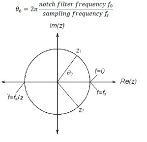
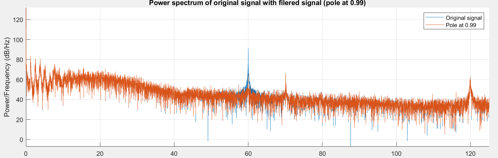
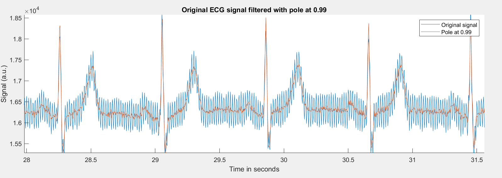

# Removal of powerline noise interfernce 

## Background:
A major source of interference in ECG signals is the 50 or 60 Hz power-line frequency. This can interfere with the readability of the signals. 

  
## Goal:
Removal of powerline noise intergerence from ECG signal
  
## Approach:
The power-line frequency component can be removed by using a notch filter, in which a zero is placed on the unit circle at the location corresponding to this frequency. The notch filter can be derived from the angular position of the required zero on the unit cirlce as given by:  
  

  
  
## Results:
  
**Power Spectral density of ECG signal before and after filtering**
  
  
**Filtered signal overlapped over the original signal**

