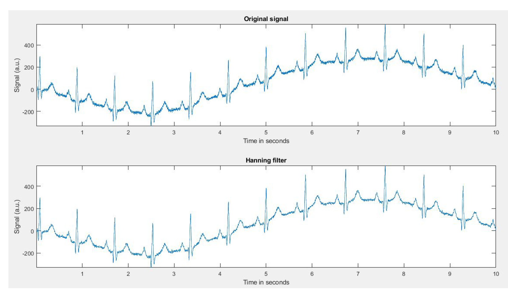
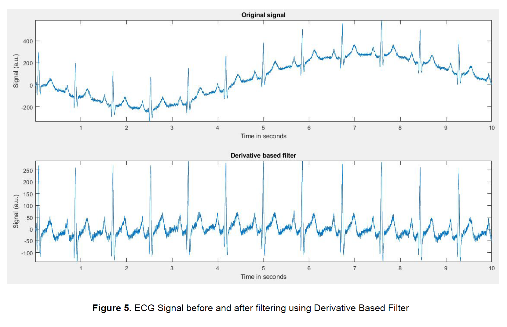
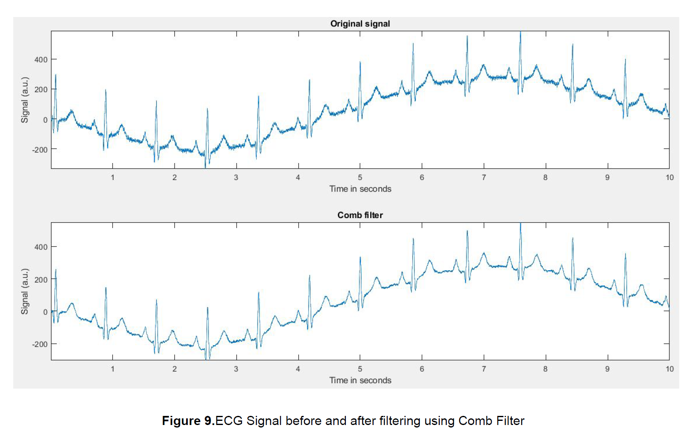
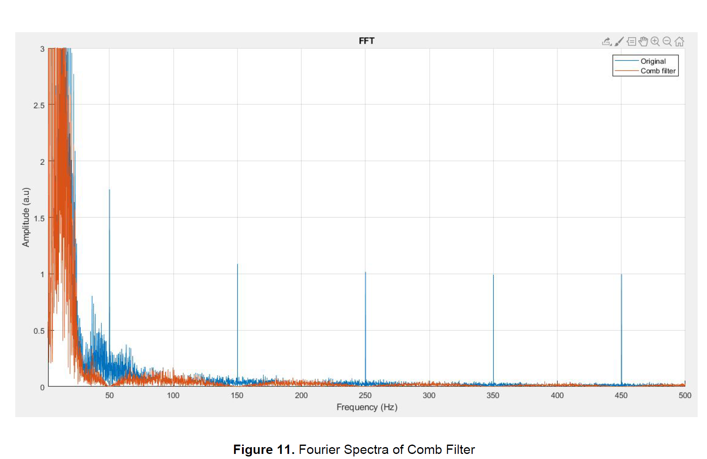
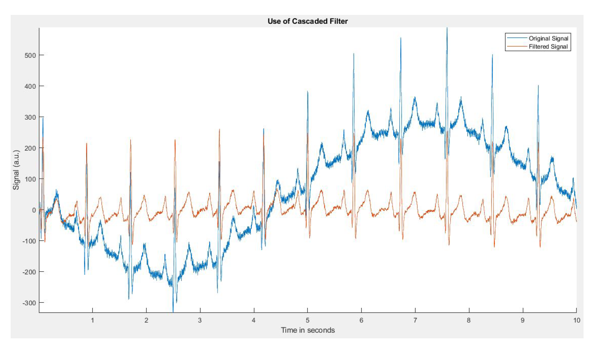

# Cascaded filtering for ECG

## Background:
ECG signal noise is considered to be a major obstacle that can interfere with the
visualization and interpretation of an ECG signal. Thus, proper filtering of ECG signal to remove
noise interference is considered to be an important process to obtain a signal with minimum
noise contamination. This signal can then be interpreted by a medical professional or a
computer assisted device for monitoring or diagnostic purposes. The sources of the noise from ECG signal can be attributed to

*	**High frequency noise** – Powerline interference and physiological artefact (EMG signals that interfere with ECG)
*	**Low frequency noise** – Movement of the chest during respiration 
  
## Goal:
Develop a filter for the removel of the sources of noise mentined previously.
  
## Approach:
 High frequency will be removed using a **hanning filter**, lower frequency removal using a **derivative filter**, comb filter for the removal of powerline noise interfernce and its harmonics (50, 150, 250, 350, 450 hz).
  
  
## Results:
  
**Hanning filter for removal of high frequency components**
  
  
**Derivative filter to remove baseline slow frequency drift from breathing**

**Comb filter for removal of powerline interfernce and its harmonics, this harmonics can be observed in the power spectrum of the original signal**
  
  

**Effects of all the three previous filters combined in a cascade filter**

