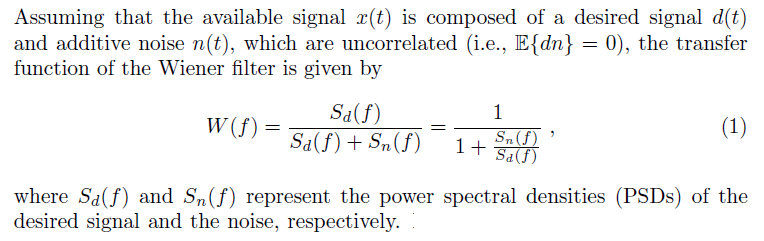
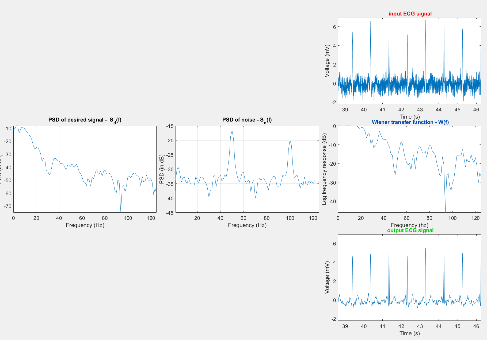

# Removal of powerline noise interfernce 

## Background:
A major hurdle in signal filtering is performing a filtering operation when the signal and noise spectrum overlap signficantly. In this case, traditional filters
cannot be emplyed since they can distort the original signal. Wiener filter theory provides an optimal filtering scheme by taking the statistics of the signal and
noise process into account. The output is considered to be an estimate of a desired signal that represents the desired signal.
  
## Goal:
Apply the Wiener filter formulation in order to filter the ECG signal.
  
## Approach:
The transfer funvtion of the wiener filter requires the extraction of the power spectrum of the desired signal (QRS complex, P and T waves of the ECG) and that of the noise:  
  
   
 The former is derived by first concatentating linear segments to provide P, QRS and T waves with amplitudes, duration and interval similar to those in noisy ECG signal. The power spectrum of
the noise is derived from linear iso-electric segments of the ECG where a few segments are selected and their power spectrum is estimated and averaged.
  
  
## Results:
  
**Concatenated and interpolated desired signal** 
  
**Noise and desired signal PSD, transfer function of Wiener filter, signal before and after filtering**

