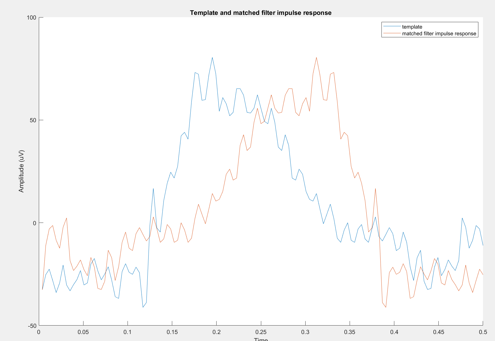

# Eye blink detection with matched filtering

## Background:
EEG data are often contaminated by artefact. On the most prevalent eyeblink artefacts are eyeblink artefacts which are high amplitude waves that return to baseline
after one second of their onset:  

 
Since those artefacts can distort the signal, it is important to find a method where they can be easily detected and removed.
  
## Goal:
Develop a method for the automatic detection of the eye blinks in the EEG signals.
  
## Approach:
Since this artefact has a characteristic shape, it can be detected by an automatic method based on matching with a template of the artfiact
extracted from the data when the eyeblink occurs. Computing the cross correlation of the template with the whole signal will yield a high response where the
peak of the output will correspond to the onset of the blink. This method is known as **template matching**. 
  
## Results:
  
**Template of the eye blink and its corresponding impulse response**
  
  
**Result of applying the matched template filter to the signal. It should be noted that the convolution of impulse response with the frequency domain of the 
signal is equivalent to a cross correlation of the original template with the original signal in time domain. The delay of the onset correspond to the 
length of the template (300 ms)**

