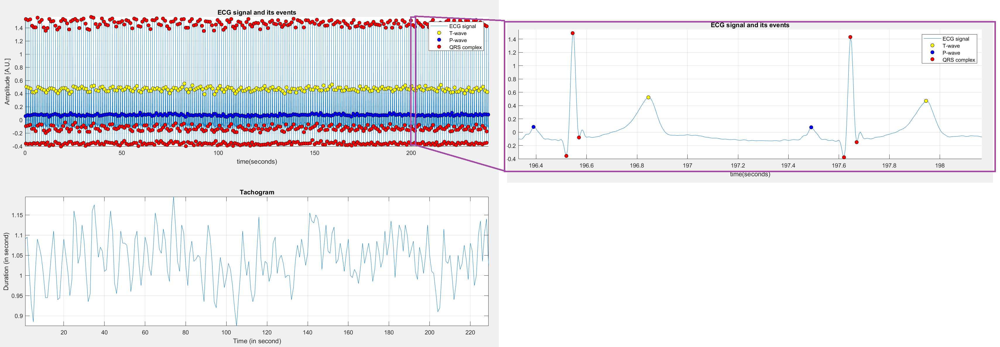

# Detection of waves in the electrocardiogram

## Background:
The features of the waveform of the electrocardiogram are associated with different events during the cardiac cycle:

*	**The P wave** Related to atrial contraction. It has a small amplitude of (0.1-0.2 mV) and lasts for 80 ms
*	**The QRS wave** Related to ventrocular contraction. It has a small amplitude of (1 mv) and last for 80-100 ms
*	**The T wave** Appears after the QRS, related to ventricular relaxation. It has a small amplitude of (0.1-0.3 mV) and extends over 120-160 ms.

Detection of the various waves can be of importance since the abscence or delay of certain waves can be attributed to certain diseases. The heart rate variability
can be also estimated from the distance between subsequent peaks of the QRS and can be a reliable indicator for assessing the short and long term physiological
state of the patient.
  
## Goal:
Implement an algorithm for detecting the QRS complex of an ECG signal and estimate the heart rate variability (HRV). 
  
## Approach:
The implementations of this algorithm was inspired by the **Pan-Tompkins algorithm** as illustrated in the Textbook *"Biomedical signal processing, Rangaraj M. Rangayyan"*.
The heart rate variability (aka Tachogram) was calculated as the distance between the corresponding R peaks.
 
## Results:
  
**ECG waves and the corresponding tachogram**
  
  

