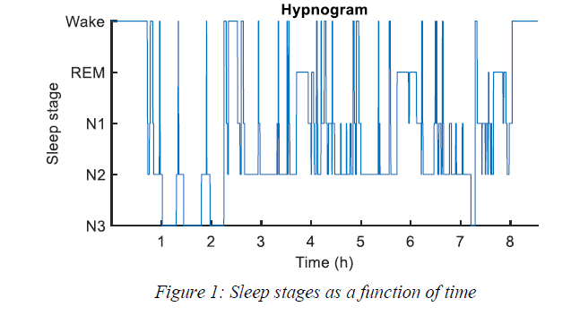
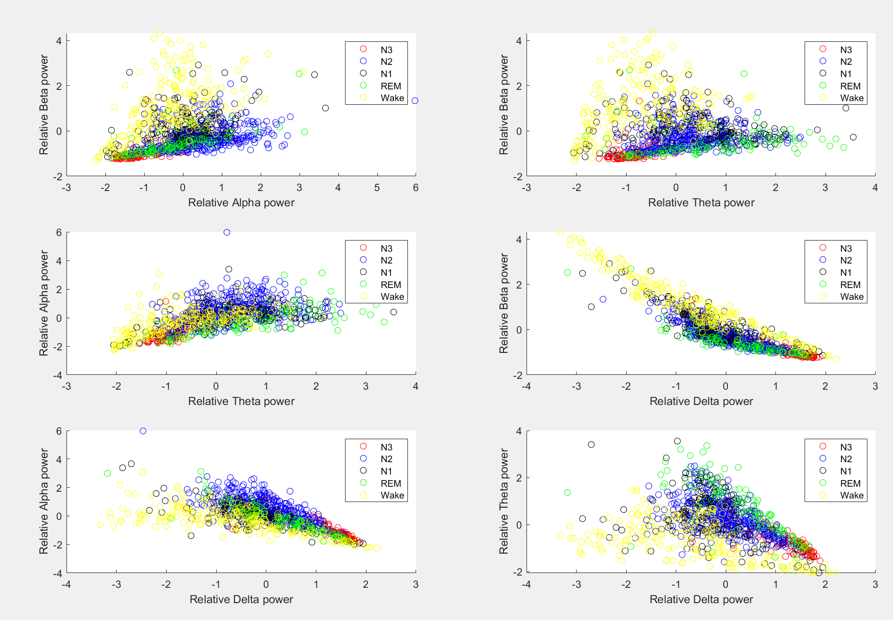
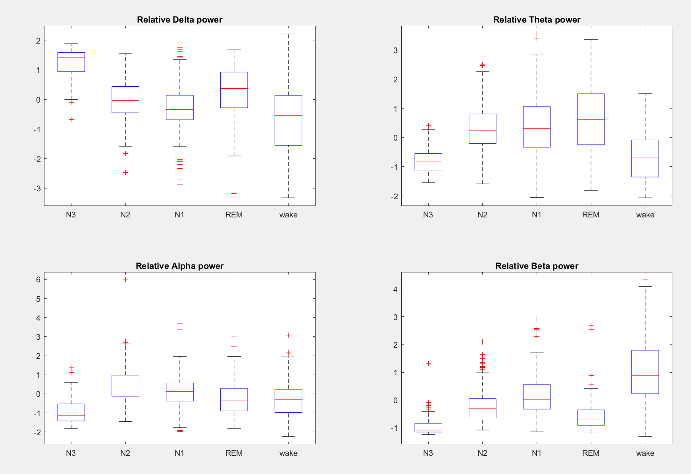
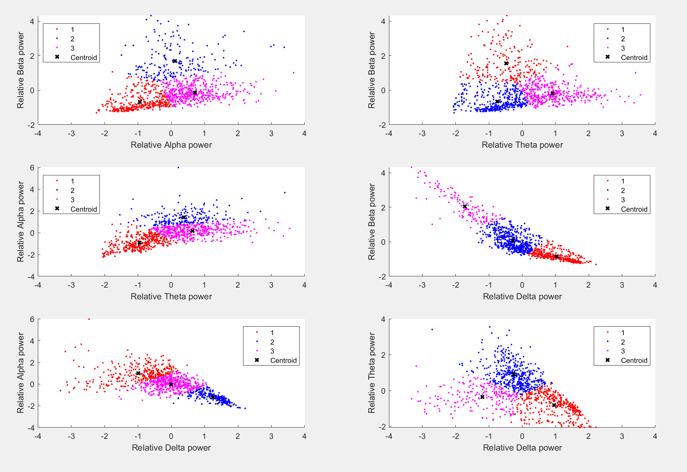
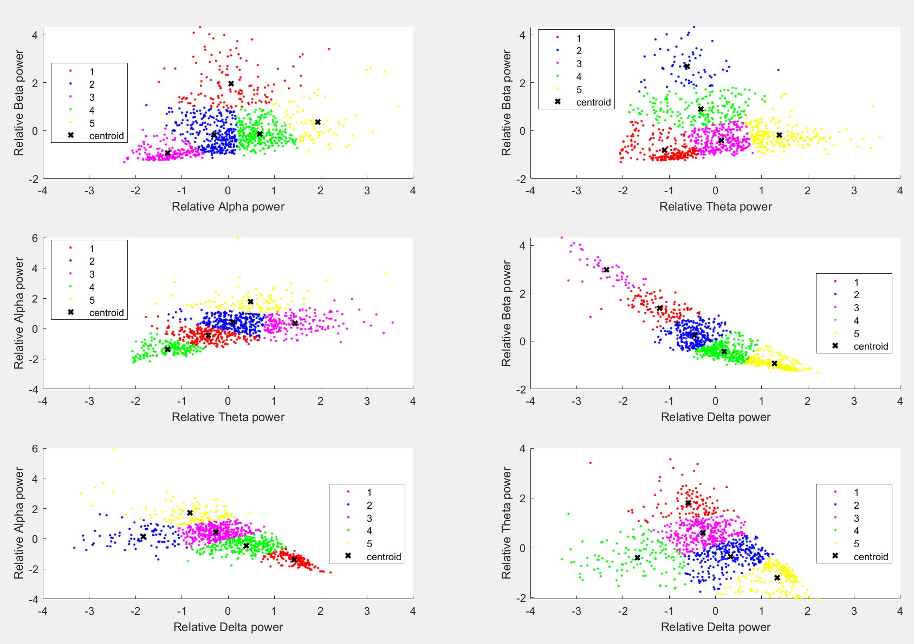
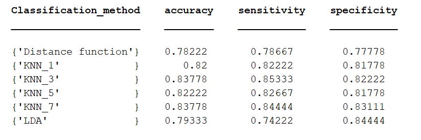
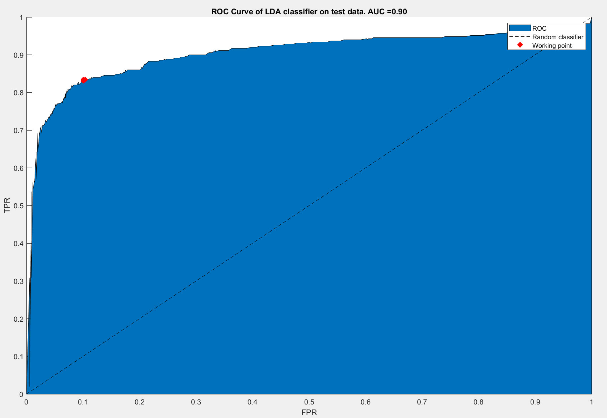

# Unsupervised and supervised classification of sleep data 

## Background:
The normal sleep-wake cycle of an adult consists of 3 main sleep stages: the awake stage, non-rapid eye movement stage (NREM) and rapid eye moment stage (REM).
The NREM stage is further subdivided into transitional sleep (N1), light sleep (N2) and deep sleep (N3). Analysis of the sleep-wake cycling plays a crucial role in the diagnosis of sleep disorders (e.g. sleep apnea or insomnia).
The patient with sleep problems is typically admitted to the sleep lab, where an overnight polysomnography is recorded. Every 30s epoch of this polysomnography
is then visually labelled by a sleep specialist according to the sleep scoring criteria by the American Academy of Sleep Medicine.
However, manually labelling these long recordings is a tedious, time-consuming and error-prone task. Therefore, automated classification 
of sleep-wake cycling is of great interest. 

 

## Goal:

Classification of sleep stages based on features derived from single-channel EEG recording.
  
## Approach:
Derive different features from the 30s epochs of the sleep stages, those features are estimated from the power spectral density of each 30s epoch where the
relative power of different power bands within each epoch are derived: Delta (0.5-4Hz), theta(4-8Hz), alpha(8-13Hz) and beta (13-35Hz).  
  Next, we will used an unupervised classification method for seperating the different hidden structures in the unlabled data through **K-means** clustering for binary
  classification (Wake vs NREM).
  Finally, we will explore supervised classification methods: **K-nearest neigbourhood (KNN)** and **linear discriminant analysis (LDA)** . Different accuracy metrics such as
  sensitivity, specificity and accuracy as well as the receiver operating characteristic curve (ROC) will be used to assess the classification performance.
   
 
## Results:
  ### Descriptive statistics:
**Feature values for each possible feature pair**
  
  
**Boxplot of feature values per class**
  
  ### Unsupervised classification:
**K_means with k=3**
  
  
**K_means with k=5**
 

 ### Supervised classification:
 
 **Results of classification**  
    
     
  **ROC curve for LDA**  
    
 

